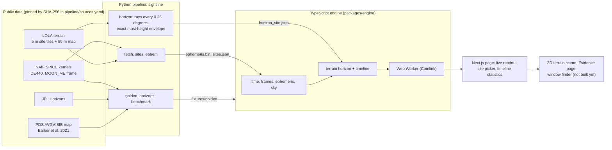

# SIGHTLINE

**Know when the Sun shines and Earth listens, anywhere on the Moon's south pole.**

SIGHTLINE computes, for a spot near the lunar south pole, where the Sun and the Earth are in the
sky and whether the surrounding terrain hides them. From that it gets the fraction of time a lander
would be in sunlight and the fraction of time it could talk directly to Earth. It runs on NASA data
(LOLA laser-altimeter terrain, NAIF SPICE ephemerides) and is checked against JPL Horizons and
published LOLA illumination work.

Our entry for **NASA Space Apps Challenge 2026**, Bangladesh local event, challenge **CLPS Lunar
Mission Browser**.

> **Stage 1 status, 2 October 2026.** The engine, the data pipeline and a working page are built and
> verified. The 3D terrain scene, the Evidence and Story pages, the window finder and the AI analyst
> are **not built yet**. Nothing below claims otherwise. What is real and what is not is listed in
> [What works today](#what-works-today).

## Why it is hard

Near the pole the Sun never climbs high: over 2026 its centre stays within about 3° of the horizontal
at all three of our sites (see [METHODS §5](docs/science/METHODS.md)). Low light means long shadows, and
that is geometry: at 1.5° of elevation one kilometre of relief throws a shadow about 38 km long. Earth
is also close to the horizon (within about 10°), so a crater wall can hide it. Whether a site gets
sunlight and a line to Earth depends on the terrain in every direction, out to the horizon, and on
how high the antenna and solar panels stand. SIGHTLINE puts numbers on that.

## What it shows

Three candidate sites, from NASA's 5 m south-pole terrain models, for **2026, hourly, a 2 m mast**.
*Average disk visible* is the mean fraction of the Sun's disk above the terrain, the quantity Barker
et al. (2021) call average illumination. *Link* is the share of time Earth clears the terrain and a
DSN station sees it. "Day" and "night" use the default lander profile (the Sun's centre above the
local horizontal).

| Site | Position (lat, east lon, height) | Average disk visible | Any part of the Sun | Link to Earth | Longest day / night |
|---|---|---|---|---|---|
| **Shackleton Rim crest** | -89.7804°, 203.803°E, 1739 m | **85.8 %** | 90.7 % | 49.9 % | 115.8 d / 185.8 d |
| **Connecting Ridge** | -89.4632°, 222.510°E, 1945 m | **45.6 %** | 51.0 % | 39.8 % | 23.8 d / 146.3 d |
| **de Gerlache Rim** | -88.6834°, 292.068°E, 1794 m | **54.0 %** | 59.5 % | 53.8 % | 25.6 d / 114.7 d |

These are **not landing sites and not published values**. Shackleton Rim is the highest point of its
5 m tile more than 1 km from the edge (the crest of the rim ridge); the other two are tile centres.
Illumination was **checked as a method**, not at these exact points (below). The link figures have
**no published reference compared yet**. Mast height matters a great deal: at Connecting Ridge the
average rises from 36 % at ground level to 48 % at 2 m (2024 to 2026). The terrain also matters: the
tile centre we first used for Shackleton sits on a roughly 32° crater wall, where any part of the Sun
was visible only 11 % of 2026 and Earth never ([D-023](docs/progress/DECISIONS.md)).

## What is verified

| Check | Result | Where |
|---|---|---|
| Sun and Earth directions against **JPL Horizons** (3 sites x 50 epochs x 2 bodies = 300 comparisons) | Largest gap **3.3e-8° for the Sun (0.0001 arcsecond)** and **2.65e-5° for Earth (0.095 arcsecond)**, against a 0.02° limit fixed beforehand: 755 times inside it. Earth's gap is a known stellar-aberration approximation | [METHODS §5.1](docs/science/METHODS.md), `fixtures/golden/horizons_residuals.json` |
| Directions against **NAIF SPICE** computed another way (144 cases) | Sun 2.1e-8°, Earth 2.7e-5°; time conversion within 1 microsecond | [METHODS §5](docs/science/METHODS.md) |
| Terrain illumination method against **Barker et al. (2021)** Table 2, seven Site 1 regions, 2024 to 2026 | Ours **74 to 85 %** at 1 m and **83 to 91 %** at 5 m, against the paper's 1st-percentile values of 67 to 71 % and 83 to 89 %. Three pass criteria fixed before the run all hold. Their values are pessimistic percentiles over DEM error clones, so this is a one-sided check | [METHODS §7](docs/science/METHODS.md), [D-025](docs/progress/DECISIONS.md) |
| Lit map against NASA's **PDS AVGVISIB** average-illumination map (900 random points in the three tiles) | **Spearman rank correlation 0.95** (0.89 to 0.98 per tile) | [METHODS §7](docs/science/METHODS.md) |

**What this does not show.** There is no published illumination value for these three sites, so
none of the table above is "validated at the sites". Both illumination checks use the same 5 m
terrain as the paper, so they do not test the terrain itself. Earth visibility and the DSN link were
not compared with anything published. The map's simulation span and observer height are not stated
in its documentation. Read [METHODS §7](docs/science/METHODS.md) before quoting any number.

## How it works



- **Frame and units.** Everything is in `MOON_ME`, the frame of the LOLA terrain, in SI units; time
  is TDB seconds past J2000. Directions include light time and stellar aberration.
- **Terrain horizon.** For each site the pipeline ray-marches the terrain in 1440 directions
  (0.25°), the 5 m tile near the site and the 80 m map out to 300 km, with exact sphere geometry.
  The tangent of a point's elevation is linear in the mast height, so each direction stores only the
  few lines that can matter and the engine evaluates the horizon **exactly** for any mast from 0 to
  20 m. The engine loads these files; it does not recompute them.
- **In the browser.** The engine runs in a Web Worker. Nothing is fetched from NASA at run time: the
  2 MB ephemeris and the horizon files ship with the app.
- **One contract.** `packages/contracts` holds the zod schemas shared by the engine and the UI.

## What works today

| Built and verified | Not built yet |
|---|---|
| Sun and Earth directions for any point, in a browser worker | 3D terrain scene (Dev 2's `packages/scene` is a stub) |
| Terrain horizon, lit fraction and link fraction for the three sites | Time scrubber, Evidence page, Story mode, mission barcode |
| Hourly timeline over 2026: statistics, longest day and night, nights longer than a 50 h battery | Window finder (best landing dates) |
| Checks against JPL Horizons, NAIF SPICE, Barker et al. (2021) and AVGVISIB | Earth-link check against a published product; other sites; years beyond 2026 |
| A repeatable data pipeline: `sightline fetch / sites / ephem / horizon / golden / horizons / benchmark` | The AI "Mission Analyst" |

**Simulated data.** A synthetic mock engine exists in the code for building the interface before real
data. It always reports `simulated: true`, and any screen that shows it must carry a purple SIMULATED
badge. **The current page shows no simulated data**, so it carries no such badge. Anything not
computed is left blank and labelled "Not computed yet", never filled with a made-up number.

## Run it

You need Node 24 and pnpm (`corepack enable` provides it). Nothing has to be downloaded to run the app.

```bash
corepack enable
pnpm install
pnpm dev            # http://localhost:3000
pnpm verify         # lint, typecheck, unit tests, parity tests with SPICE, production build
```

To rebuild the data (needs `uv`, Python 3.12, and about 400 MB of downloads):

```bash
uv sync --project pipeline
uv run --project pipeline sightline fetch --only spice --only dem
uv run --project pipeline sightline sites          # the three positions, from the DEMs
uv run --project pipeline sightline ephem          # Sun, Earth, DSN for 2026
uv run --project pipeline sightline horizon        # terrain masks for the three sites
uv run --project pipeline sightline golden         # SPICE reference fixtures
uv run --project pipeline pytest
```

Every download is checked against a pinned SHA-256 in `pipeline/sources.yaml`, the only place an
external URL appears. The generated reference files in `fixtures/golden/` are written only by
commands and are compared with the engine on every test run.

## Honesty, data and credits

- **AI use.** The code and documents were written with AI assistants (Claude Code and Google
  Antigravity). What each did, and what it got wrong, is in
  [docs/submission/AI_DISCLOSURE.md](docs/submission/AI_DISCLOSURE.md). The product has no AI inside
  it yet.
- **Decisions and mistakes** are logged as they happen:
  [docs/progress/DECISIONS.md](docs/progress/DECISIONS.md) and
  [docs/progress/PROGRESS.md](docs/progress/PROGRESS.md), including the ones we had to correct.
- **Data.** NASA LRO / LOLA terrain through the Planetary Geodesy Data Archive (PGDA products 78 and
  90); NASA NAIF SPICE kernels; NASA/JPL Horizons; the NASA PDS Geosciences Node (AVGVISIB map).
  Full citations: [docs/science/CITATIONS.md](docs/science/CITATIONS.md).
- **Not endorsed by NASA.** No NASA logo, insignia or wordmark is used anywhere in this project;
  NASA is credited in text only.
- **Licence.** Apache-2.0 ([LICENSE](LICENSE)). Data keeps its providers' terms.

## Team

| Role | Who |
|---|---|
| Core science, engine, data pipeline, validation, merges (Dev 1) | Team lead, GitHub `WarRinOP` |
| 3D terrain scene (Dev 2) | Aktaruzzaman, GitHub `rimonxyg` |
| App interface, state, Evidence and Story pages (Dev 3) | Fuad Hasan, GitHub `fuadhasandipro` |

Stage 1 of the Bangladesh program is a public repository and a 240-second video, due 7 October
(as reported by our team lead; the exact time and format are still being confirmed with the
organizers). The on-site program is 13 and 14 November, for selected teams. Our team's registration
on [nasaspaceappsbd.com](https://www.nasaspaceappsbd.com) is still to be completed.

> Early start: the team says our local event allows work before the hackathon, but the Bangladesh
> site does not state it. Written confirmation is still pending and is tracked in
> [D-010](docs/progress/DECISIONS.md).

## For the team

| File | Purpose |
|---|---|
| [docs/science/METHODS.md](docs/science/METHODS.md) | The science: frames, ephemeris, horizon, validation, benchmark |
| [docs/submission/DEMO_SCRIPT.md](docs/submission/DEMO_SCRIPT.md) | The 240-second video script |
| [docs/WHAT_WE_ARE_BUILDING.md](docs/WHAT_WE_ARE_BUILDING.md) | Plain-language overview for teammates |
| [docs/TEAM_WORK_SPLIT.md](docs/TEAM_WORK_SPLIT.md) | Who builds what: folders, interfaces, tickets |
| [docs/MASTER_PLAN.md](docs/MASTER_PLAN.md) | The full blueprint and calendar |
| [docs/progress/REMAINING.md](docs/progress/REMAINING.md) | What is left, by task id |
| [AGENTS.md](AGENTS.md), [CLAUDE.md](CLAUDE.md) | Rules for the AI agents working in this repo |
